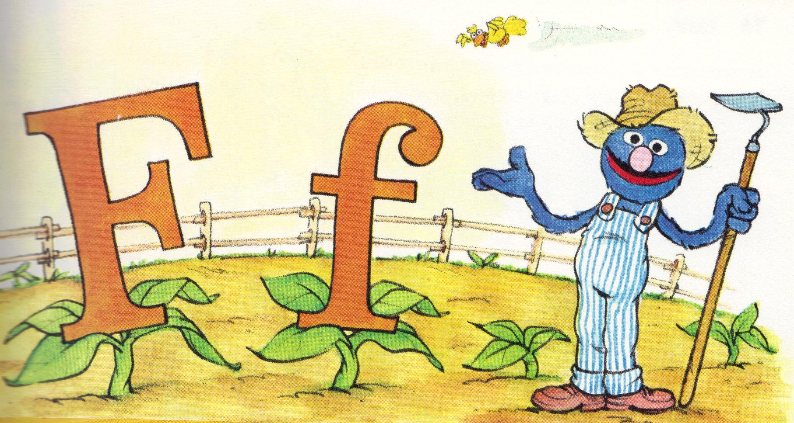

## JAVASCRIPT CODING QUIZ

## So my app was supposed to look like this...


## But I didn't quite accomplish that...

 


## REFLECTIONS:

```
In the previous assignment I felt completely lost on where to even begin, let alone in recalling all tools available to me AND their syntax. I needed to reference several examples, and still needed my hand held. I more or less mimicked a commonality found in all of the examples I found.

On this assignment however I did not. I felt, not confident, but feebly able to take the plunge and just start coding from scratch. What I came up with I knew might be a completely assinine approach and need to be scrapped, but at least I was allowing my mind to just freely code and try to solve on the spot for the first time on a major JS task.

What I should have done was use that as an exercise, not indulge it indefinitely. I should've referenced other examples sooner and tapped tutoring resources earlier in the week, when there was time to rebuild if I were to find out my approach should be torn down.

So the way it work out essentially was that I had each question/question 'page'/question experience/etc. all within individual blocks of code that was casting itself on the skeleton of a quiz box I had in place over in the html. One 'choice' was the 'correct answer', which was nothing more than calling a function that just took us to the next block of code. Pretty rudimentary and a lot of copypasta between questions/question.

The score keeping and timer I used were of course referenced from the past week's activities, of which we learned of such things, and used modularly with my code.

It was unsightly, beginner-y, and needed to be scrapped not operated on until it was due.

I should've used an array to rotate out the questions. I should've had a different way of qualifying correct answers. I should've had the board wipe clean and present a new div with the final score, not jump over to a completely different html page.

I should've done a lot of things differently.

Anyway, I failed and am turning in a non-functional mess of code. I know the criteria for grading, though it varies amongst graders,
likely all holds functionality and performance as paramount. In that sense, I know that this might qualify as an 'F', and I accept that if that is the case.

That being said however, on a positive note, I am more curious of the feedback, criticism, and analysis of THIS attempt as it was uninformed by outsider examples/suggestions and completely from my own baby-step formulating.

This might be more beneficial as a failure, than a successful assisted recovery attempt.

Anyway, sorry for the verbosity of this README... a README of a non-functioning application, no less.

- Desmond

```

